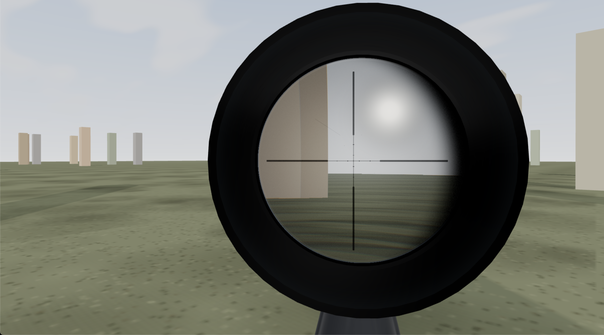
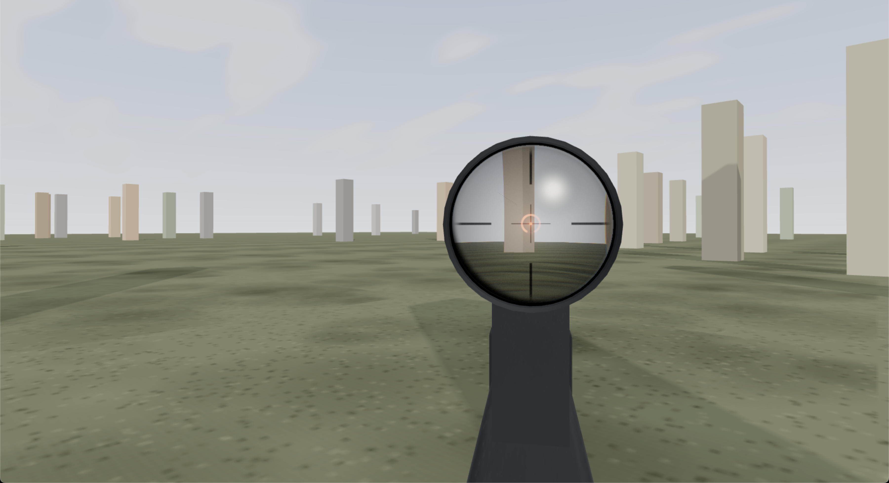

# Scope — gamified rifle-scope optics demo




Live demo: **https://scope-ten-phi.vercel.app/**

Three.js / Vite / TypeScript first-person rifle-scope demo by Piotr Szulc
(kkragoth@gmail.com). A vibecoded testbed for **gamified scope effects** —
eye relief, exit-pupil eye-box crescent, free-aim reticle lead, shoulder-pivot
weapon sway, ADS depth-of-field, sun glare/occlusion — rendered through a
custom GLSL sight-picture shader.

Desktop only (pointer lock + mouse). Click to enter.

## Controls

- **WASD**: move · **mouse**: look · **Q/E**: lean · **Shift**: hold breath
- **Right mouse**: aim down sights · **wheel**: magnification
- **LMB**: fire (sniper single-shot / ACOG **V** toggles SEMI-AUTO) · **R**: reload
- **1/2**: sniper scope / ACOG red dot · **C**: reticle red/green · **B**: battery
- **F**: FFP reticle · **K**: right-eye / centered · **G**: eye-box hold mode
- **X**: sway mode · **Z**: zoom-blackening response · **N**: crescent side
- **P**: crescent power · **O**: mirror dim/bright · **T**: glass rings DOF
- **H**: hide UI

## Architecture

`src/main.ts` is a thin composition root (imports + `animate()` + resize).
Everything else is split by domain; cross-module imports use the `@` alias
(`@/*` → `./src/*`, see `tsconfig.json` paths + `vite.config.ts`
`resolve.alias`) — no `../../` chains.

```
src/
  main.ts                 composition root: evaluation order, loop start
  core/
    boot.ts               renderer / scene / camera / sun + lights
    player.ts             player rig, weapon mount, ADS anchors, gun springs
    input.ts              pointer-lock, mouse, keys → store + actions
    loop.ts               frame simulation + render passes (scope RT, DOF)
  world/
    environment.ts        sky dome, sun sprites, ground, obstacle field
  weapons/
    materials.ts          parkerized steel / anodized scope PBR materials
    sniper.ts             bolt-action rifle + ring-mounted scope tube
    groups.ts             sniper/acog optic-assembly swap groups
    acog.ts               carbine + prism housing + fiber collector
    effects.ts            muzzle-flash sprite + pooled brass ejecta
  optics/
    targets.ts            scope render target
    dof.ts                ADS depth-of-field chain (parked map pass + state)
    scopeRig.ts           scope camera, sight-picture lens, glass surfaces
  shaders/                raw GLSL imported via Vite `?raw`
    lens.vert / lens.frag     sight picture: reticle, CA, eye-box, glare
    sky.vert / sky.frag       gradient dome, clouds, sun disc
    glass.vert / glass.frag   ocular/objective coating + fresnel
    post.vert / blur.frag / dof.frag   DOF composite passes
  state/
    store.ts              single mutable holder `S` + tuning constants
    actions.ts            fire / reload / optic swap / battery
  ui/
    hud.ts                help banner + state pills
```

Design notes:

- `state/store.ts` owns **all** cross-module mutable scalars on one holder
  object `S` (ES import bindings are read-only, so `export let` can't be
  assigned across modules). `const` objects need no wrapper.
- Frame state advances in `core/loop.ts:animate()`; input only writes intent
  into the store. Builders run once at import time, in `main.ts` order.
- The lens/sight GLSL lives in `src/shaders/*.glsl` and is imported with
  `?raw` — edit shaders without touching TypeScript.

## Commands

```sh
npm run dev      # local dev server (opens browser)
npm run build    # tsc + vite build (Vercel deploy target)
npm run preview  # serve the production build
npm run lint     # eslint (rules reused from note-canva, see below)
npm run format   # prettier file list
npm run check    # prettier --write . && eslint --fix
```

`npx tsc --noEmit` typechecks (also part of `build`).

## Lint

ESLint + Prettier configs, scripts (`lint` / `format` / `check`) and dev
dependencies are reused 1:1 from `~/dev/note-canva`
(`@tanstack/eslint-config` + 4-space indent, always-semi, single-quote,
trailing-comma overrides). Two scope-side notes:

- `tsconfig.json` adds `"allowJs": true` so the root JS configs are part of
  the TS project — without it the type-aware parser reports "file was not
  found in any project" (same errors note-canva itself reports on its own
  config files).
- Prettier (`semi: false`, 2-space) and ESLint (`semi: always`, 4-space)
  intentionally disagree, same as upstream: `npm run check` runs prettier
  first and `eslint --fix` last, so the committed style is 4-space + semis.
